# Admin-Tutorial (Kurzfassung)

Diese kurze Schritt-für-Schritt-Anleitung zeigt den typischen Ablauf im Adminbereich: vorbereiten, versenden und Rückläufe importieren.

## 1. Als Admin anmelden

Melden Sie sich mit den bekannten SVWS-Zugangsdaten an und öffnen Sie den Adminbereich.

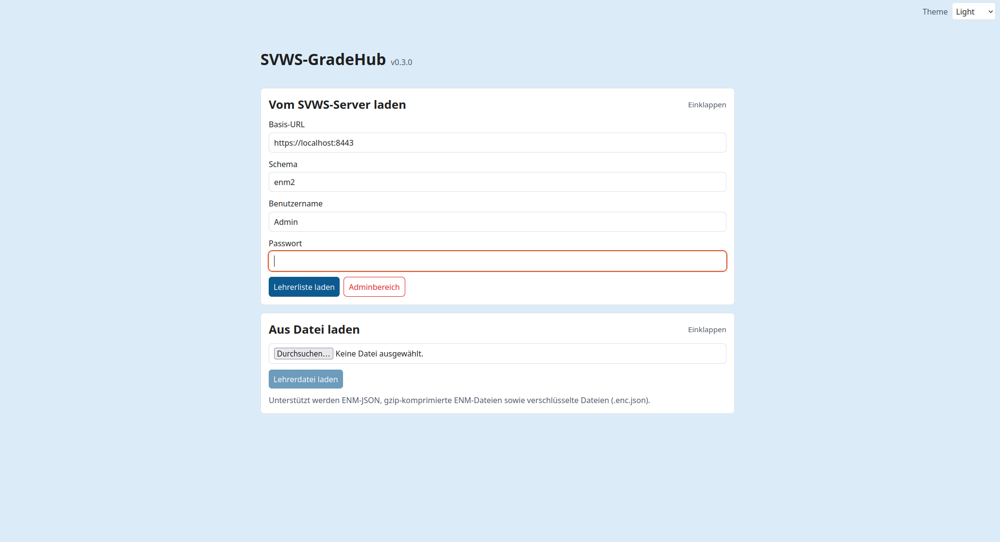

## 2. Adminbereich öffnen

Prüfen Sie die Lehrerliste und wählen Sie die relevanten Lehrkräfte aus.

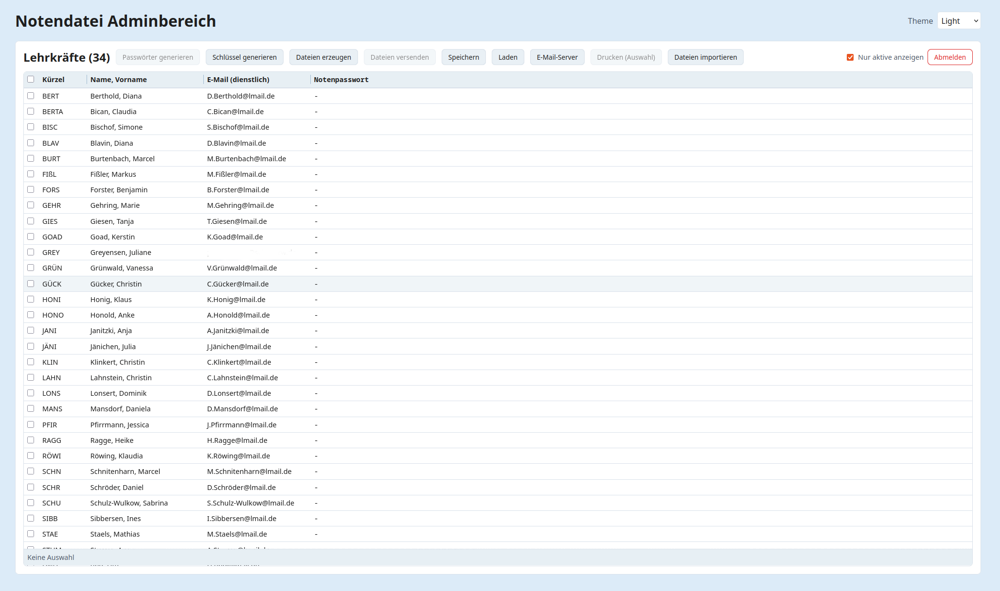

## 3. Schulschlüssel erzeugen

Klicken Sie auf Schlüssel erzeugen und erstellen Sie das RSA-Schlüsselpaar.

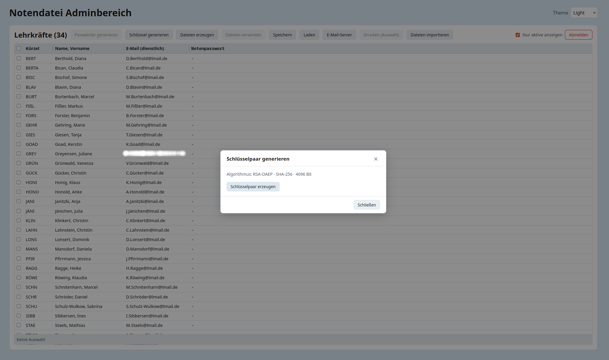

Nach erfolgreicher Erstellung sehen Sie die Bestätigung im Dialog.

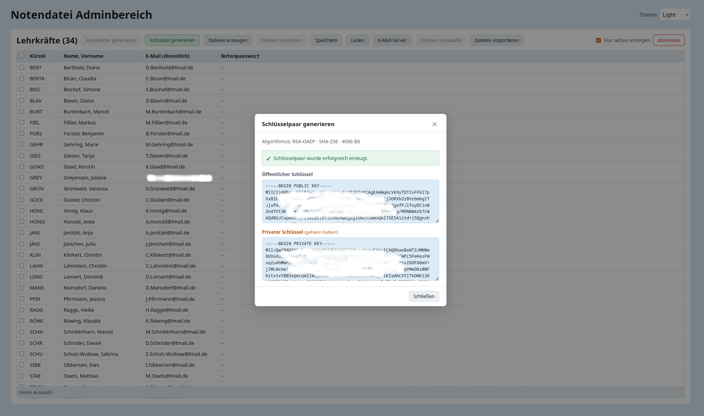

## 4. Notenpasswörter generieren

Generieren Sie für die ausgewählten Lehrkräfte neue Notenpasswörter.
Der Ausdruck der Kennwörter dient dazu, den Lehrkräften das jeweilige Kennwort auf sicherem Weg zu übergeben.

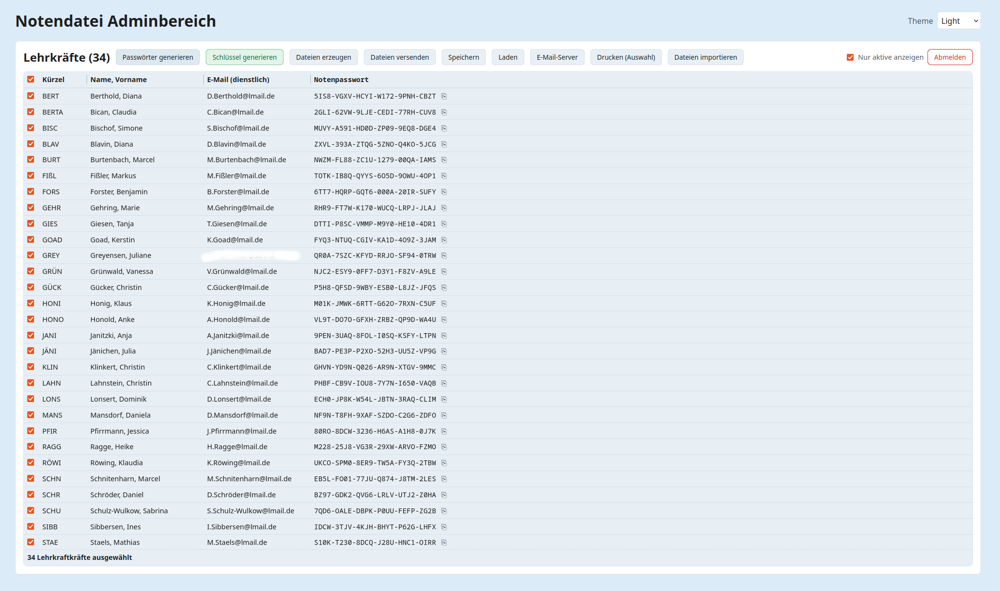

Kontrollieren Sie, dass jede Lehrkraft ein Passwort hat.

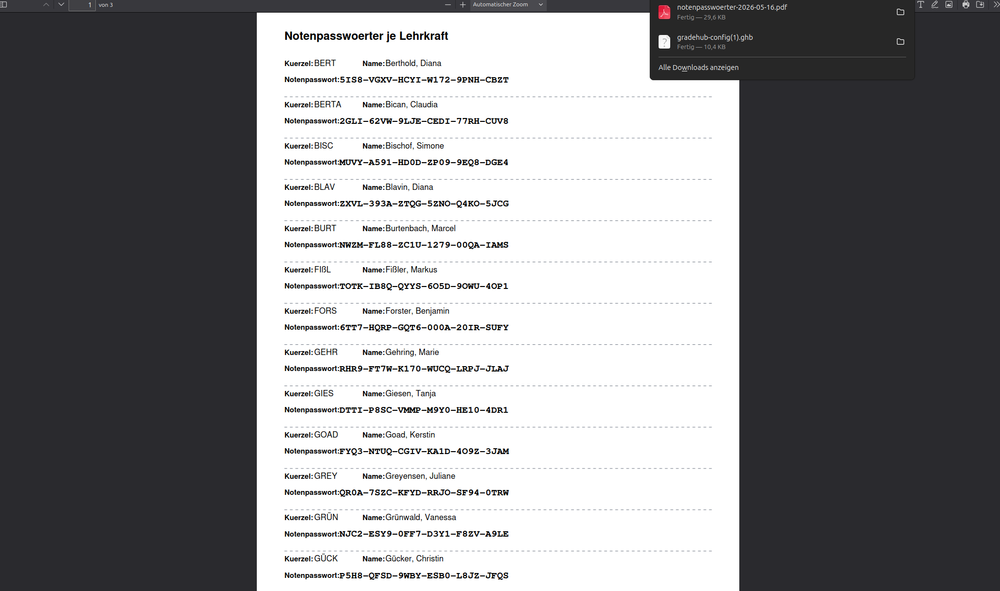

## 5. E-Mail-Server eintragen (nur Server-Version)

Öffnen Sie E-Mail-Server konfigurieren, tragen Sie SMTP-Daten ein und testen Sie die Verbindung.

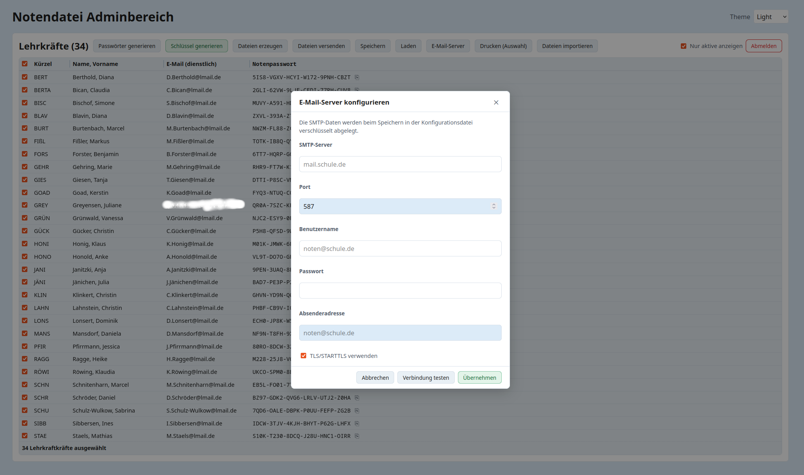

## 6. Konfiguration speichern

Speichern Sie die Admin-Konfiguration als verschlüsselte GradeHub-Datei (`.ghb`).
Es werden keinerlei Daten dauerhaft im Browser oder an anderer Stelle gespeichert.
Bewahren Sie deshalb die Konfigurationsdatei und das zugehörige Passwort sicher und gut auf, damit Notendateien später wieder entschlüsselt werden können.

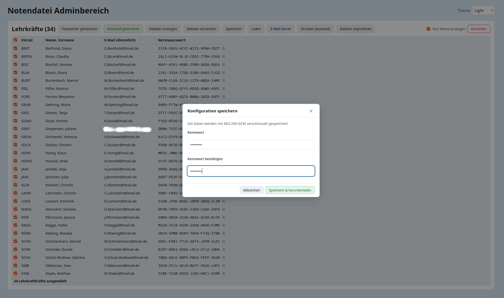

## 7. Rückläufe importieren

Nach der Noteneingabe durch Lehrkräfte öffnen Sie Dateien importieren und laden die Rücklaufdateien.

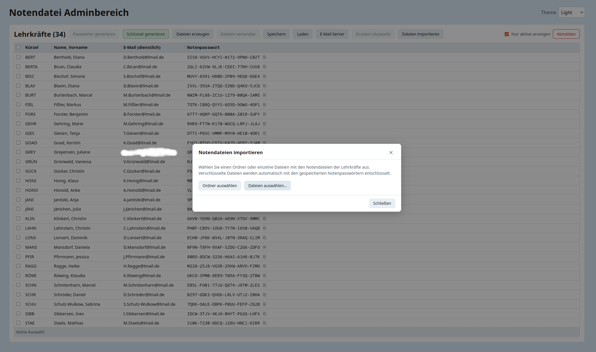

Prüfen Sie die erkannten Dateien und den Status.

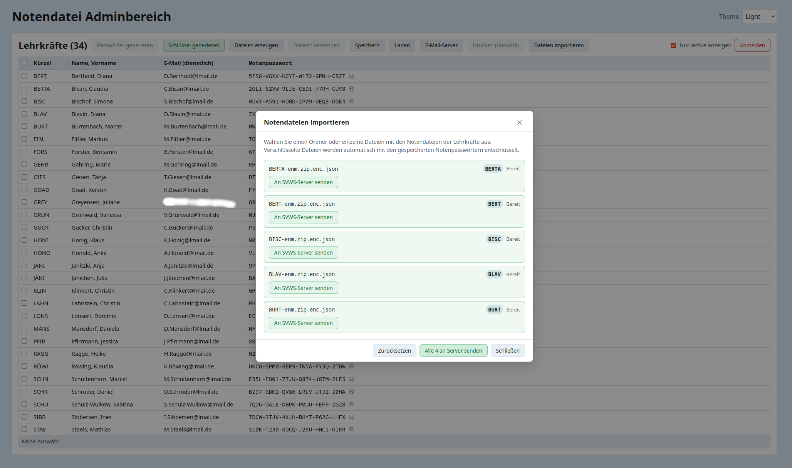

Senden Sie die bereiten Einträge an den SVWS-Server (einzeln oder gesammelt).

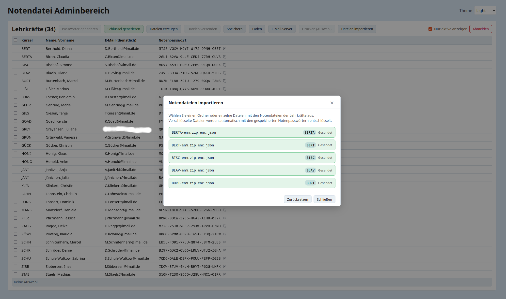

## Abschluss

Wenn alle Einträge den Status Gesendet haben, ist der Import abgeschlossen.